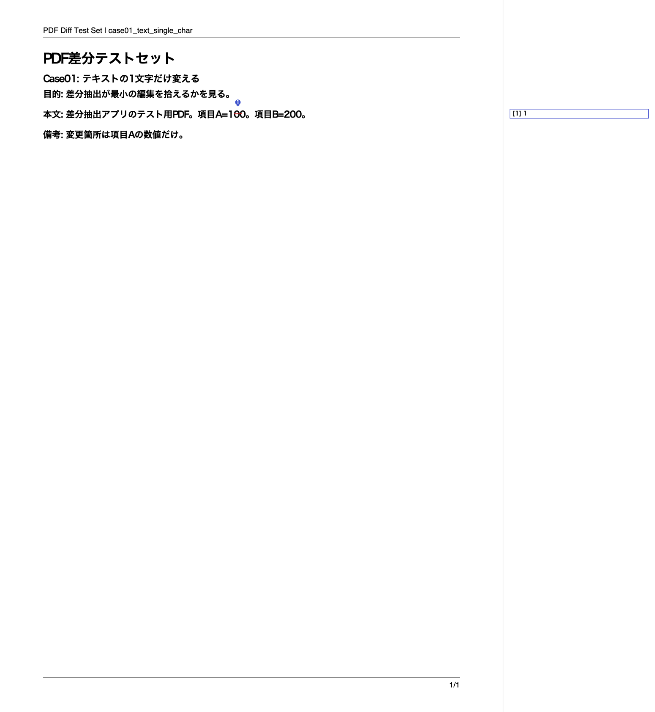

# difff-pdf

日本語版 `difff.pl` を中心にしたテキスト/PDF比較ツールです。

- テキスト比較とPDF比較を**単一フォーム**で実行
- 比較ボタンは1つ（PDF2本がある場合はPDF比較を優先）
- PDF比較では `srcA/srcB/annA/annB/annComment` を出力
- 旧「3日限定公開（save/delete）」機能は廃止
- `en` ディレクトリは廃止（`/en/` は提供しない）

## 1. 必須コマンド

- `perl`
- `diff`
- `pdftotext`（`-bbox-layout` 利用）
- `uv`
- `node` / `npm`（Electron利用時）

## 2. セットアップ

```bash
cd /Users/kh/MyWorkspace/difff-pdf
uv sync --project tools --offline --no-python-downloads || uv sync --project tools
```

## 3. Web版（CGI）起動

```bash
cd /Users/kh/MyWorkspace/difff-pdf
uv run --project tools python -m http.server --cgi 8000
```

開くURL:

- `http://localhost:8000/cgi-bin/difff.pl`

## 4. 操作フロー（統一UI）

1. `A/B` テキスト欄に入力（任意）
2. `PDF A/B` を選択（任意）
3. 「比較」を押下

モード判定:

- `pdfA` と `pdfB` が両方ある -> PDF比較
- PDFが片側のみ -> エラー
- PDFなしでテキストあり -> テキスト比較
- テキストとPDF両方入力でもPDF2本ある -> PDF優先

## 5. 結果

- 差分表（テキスト/PDF共通）
- 統計（文字/空白/改行/単語）
- PDFモード時のみ成果物リンク:
  - `srcA.pdf`
  - `srcB.pdf`
  - `annA.pdf`
  - `annB.pdf`
  - `annComment.pdf`

annComment.pdf の出力例:



## 6. 一時成果物

PDF比較の成果物は `data/tmp/<token>/` に保存され、TTLで掃除されます。

- 掃除設定: `DIFFF_TMP_TTL_MINUTES`（既定 `120`）

## 7. Electron（デスクトップ）

### 7.1 インストール

```bash
cd /Users/kh/MyWorkspace/difff-pdf
npm install
```

### 7.2 開発起動

```bash
npm run electron:dev
```

Electronは内部でローカルCGIサーバを起動し、`/cgi-bin/difff.pl` を表示します。

## 8. 配布ビルド（未署名・内部配布向け）

```bash
npm run electron:dist
```

出力先:

- `dist/*.dmg`
- `dist/*.zip`

## 9. 再インストール前チェック

1. 既存アプリ版数を確認:

```bash
defaults read /Applications/difff-pdf.app/Contents/Info CFBundleShortVersionString
```

2. BUILD識別子を確認（`difffBuildSha` / `difffBuildTime`）:

```bash
strings /Applications/difff-pdf.app/Contents/Resources/app.asar | rg -n 'difffBuildSha|difffBuildTime'
```

3. 期待する版数/BUILD_IDでなければ、アプリを置き換えて再インストール。

## 10. 配布物検査（手動）

```bash
cd /Users/kh/MyWorkspace/difff-pdf
TMP_DIR=$(mktemp -d)
(
  cd "$TMP_DIR" && \
  ./node_modules/.bin/asar extract-file \
    /Users/kh/MyWorkspace/difff-pdf/dist/mac-arm64/difff-pdf.app/Contents/Resources/app.asar \
    electron/server.cjs && \
  rg -n 'DIFFF_DESKTOP_READY_TIMEOUT_SEC|READY_MARKER_RE|compare-form|rootUrl' server.cjs
)
```

## 11. トラブルシュート

### 11.1 `CGI server did not become ready` が出る

1. 起動ログを確認:

```bash
cat "$HOME/Library/Application Support/difff-pdf/logs/startup.log"
```

2. 既存ポート競合を疑う場合:

```bash
lsof -nP -iTCP:18765 -sTCP:LISTEN
```

3. ランタイムを掃除して再起動:

```bash
rm -rf "$HOME/Library/Application Support/difff-pdf/runtime"
```

4. それでも解消しない場合は、エラーダイアログに表示される `BUILD_ID` と `startup.log` を確認して版差分を切り分ける。

## 12. 環境変数

| 変数名 | 既定値 | 用途 |
|---|---:|---|
| `DIFFF_PDF_MAX_MB` | `50` | PDF1ファイル上限(MB) |
| `DIFFF_TEXT_MAX_CHARS` | `5000000` | 抽出/入力テキスト上限 |
| `DIFFF_PDFTOTEXT_CMD` | `/opt/homebrew/bin/pdftotext` | `pdftotext` 実行パス |
| `DIFFF_PDFTOTEXT_TIMEOUT_SEC` | `60` | `pdftotext` タイムアウト |
| `DIFFF_UV_CMD` | `/opt/homebrew/bin/uv` | `uv` 実行パス |
| `DIFFF_UV_TIMEOUT_SEC` | `60` | `uv run` タイムアウト |
| `DIFFF_DIFF_BRIDGE_CHARS` | `2` | 削除赤線ブリッジ判定文字数 |
| `DIFFF_TMP_TTL_MINUTES` | `120` | `data/tmp` 掃除TTL |
| `DIFFF_BASE_URL` | 自動判定 | CGIベースURL |
| `DIFFF_DESKTOP_PORT` | `18765` | Electron優先ポート |
| `DIFFF_DESKTOP_READY_TIMEOUT_SEC` | `120` | Electron ready判定タイムアウト |
| `DIFFF_DESKTOP_STARTUP_TIMEOUT_SEC` | `120` | 旧名称（互換） |
| `DIFFF_DESKTOP_UV_SYNC_TIMEOUT_SEC` | `180` | Electron起動時 `uv sync` タイムアウト |
| `UV_PYTHON` | 任意 | `uv` のPython固定 |

## 13. 検証コマンド

```bash
perl -c /Users/kh/MyWorkspace/difff-pdf/difff.pl
uv run --project tools python -m py_compile /Users/kh/MyWorkspace/difff-pdf/tools/pdf_annotate_diff.py
node --check /Users/kh/MyWorkspace/difff-pdf/electron/server.cjs
node --check /Users/kh/MyWorkspace/difff-pdf/electron/main.cjs
```

## License

Copyright &copy; 2004-2025 Yuki Naito
([@meso_cacase](https://twitter.com/meso_cacase))

This software is distributed under [modified BSD license](https://www.opensource.org/licenses/bsd-license.php).
